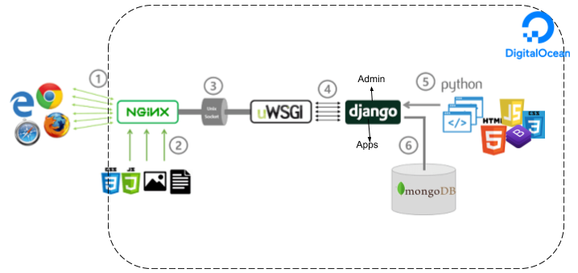

## Proyecto Chatbot y trazabilidad para el estado peruano #CoronaVirus


Somos un movimiento voluntario de activistas de la información al servicio de una sociedad abierta, nuestra base de fundamenta en la transparencia y colaboración a partir de la integración cultural.
Si te sientes identificado únete a este movimiento.

Nuestro objetivo : Impulsar un sistema de Gobernación Abierta, desde la interdisciplinaria entre hackactivista, gobierno y sociedad civil.

### Requisitos:
- git
- pip3 
- virtualenv 
- python3.6.8 
- mongodb-4.0
- django2.2

### Ejecución en modo desarrollo:

```
git clone git@github.com:alejandrohdo/hackactivista.git
```
```
cp hackactivista/hackactivista/settings/config_example.json hackactivista/hackactivista/settings/config.json && cd hackactivista
```
```
pip install -r install requeriments.txt
```
Confgurar su DB, antes de ejecutar las migraciones.. 

```
./manage.py makemigrations && ./manage.py migrate
```
```
./manage.py createsuperuser
```
```
 ./manage.py runserver
```

### En mongod.conf, configuración de mongodb
en terminal ejecutar
>> use admin
>> db.createUser( { user: "user_xxx", pwd: "passs_xxx", roles: [ { role: "userAdminAnyDatabase", db: "admin" }, "readWriteAnyDatabase" ] } )


>> sudo nano /etc/mongod.conf

bindIp: IP_PC_Interna  : NOTA:Cuidado con poner la Ip PUBLICA si no, no hara comunicacion
security:
  authorization: "enabled" o "disabled"  # Para autenticar o no

>> sudo service mongod restart 

por último en config/develop.json, actualizar conexión a DB